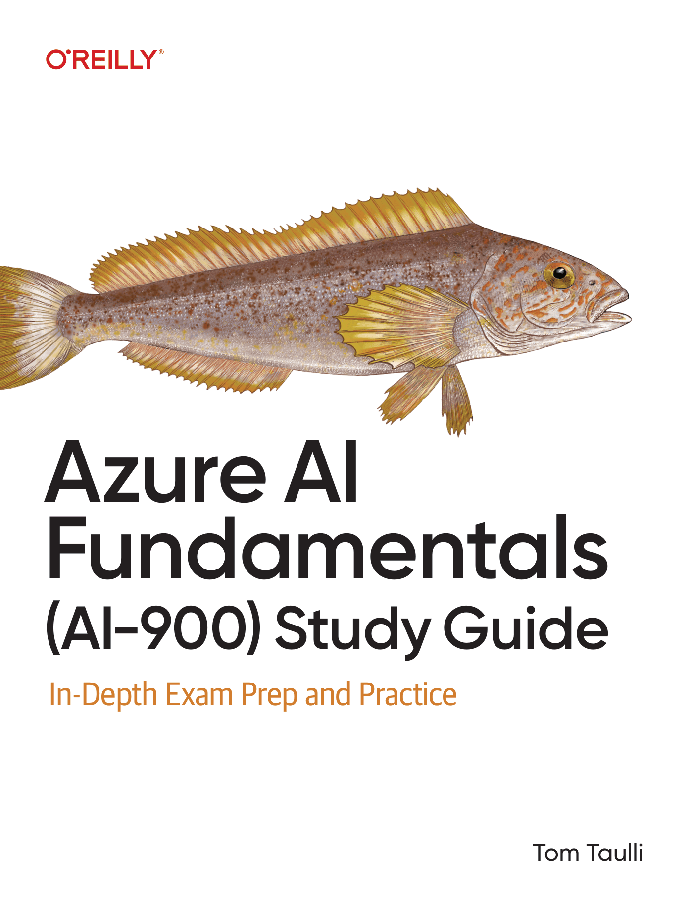

## Purpose 

I created these **AI-900 questionnaires** to help people study for their certification, especially my colleagues. I am proudly a student from **Simplon**. 

This comprehensive guide includes chapter-specific quizzes and a full **55-question practice exam** based on the book *"Azure AI Fundamentals (AI-900) Study Guide."* I hope this resource helps you succeed on your learning journey!

  

---

## Table of Contents
1. [Chapter 3: Computer Vision & NLP](#chapter-3-practice-questions)
2. [Chapter 4: Machine Learning Principles](#chapter-4-fundamental-principles-of-machine-learning)
3. [Chapter 5: Azure Machine Learning & Model Evaluation](#chapter-5-azure-machine-learning-model-evaluation)
4. [Chapter 6: Computer Vision](#chapter-6-computer-vision)
5. [Chapter 7: Natural Language Processing (NLP)](#chapter-7-natural-language-processing-nlp)
6. [Chapter 8: Generative AI & Responsible AI](#chapter-8-generative-ai-responsible-ai)
7. [**AI-900 Final Practice Exam (55 Questions)**](#ai-900-final-practice-exam-)

---
---

# Practice Questions
## Chapter 3 

---

### 1. Which AI workload is designed to automatically detect and filter harmful or inappropriate content online?
* a. Knowledge mining
* b. Generative AI
* c. Content moderation
* d. Document intelligence

<b>Show Answer</b>

 
<blockquote>
<b>Correct Answer: C</b>  
<b>Why it's correct:</b> Content moderation is specifically designed to detect and filter harmful or inappropriate content online.
</blockquote>

---

### 2. What is the main objective of AI personalization in applications?
* a. To recommend content based on user preferences
* b. To generate new images
* c. To detect harmful content
* d. To analyze human language

<b>Show Answer</b>

 
<blockquote>
<b>Correct Answer: A</b>  
<b>Why it's correct:</b> AI personalization aims to recommend content that aligns with a user’s preferences and behavior to enhance their experience.
</blockquote>

---

### 3. Which AI workload helps analyze and interpret human language?
* a. Natural language processing (NLP)
* b. Content moderation
* c. Computer vision
* d. Document intelligence

<b>Show Answer</b>

 
<blockquote>
<b>Correct Answer: A</b>  
<b>Why it's correct:</b> NLP is the workload dedicated to analyzing, interpreting, and generating human language.
</blockquote>

---

### 4. Which AI workload uses Optical Character Recognition (OCR) to extract text from images?
* a. NLP
* b. Knowledge mining
* c. Computer vision
* d. Generative AI

<b>Show Answer</b>

 
<blockquote>
<b>Correct Answer: C</b>  
<b>Why it's correct:</b> Computer vision uses OCR to "see" and extract text from visual files.
</blockquote>

---

### 5. Which AI workload is used to uncover insights from unstructured data like text and videos?
* a. Document intelligence
* b. Knowledge mining
* c. Computer vision
* d. NLP

<b>Show Answer</b>

 
<blockquote>
<b>Correct Answer: B</b>  
<b>Why it's correct:</b> Knowledge mining is used specifically to uncover hidden insights across vast amounts of unstructured data.
</blockquote>

---

### 6. Which AI workload enables systems to generate new content, such as text or images?
* a. NLP
* b. Generative AI
* c. Knowledge mining
* d. Document intelligence

<b>Show Answer</b>

 
<blockquote>
<b>Correct Answer: B</b>  
<b>Why it's correct:</b> Generative AI is designed to create entirely new, original material.
</blockquote>

---

### 7. What API in Azure AI Content Safety is used to scan text for harmful content?
* a. Analyze Text API
* b. Analyze Image API
* c. Custom Categories API
* d. Moderate Text API

<b>Show Answer</b>

 
<blockquote>
<b>Correct Answer: A</b>  
<b>Why it's correct:</b> The Analyze Text API is the specific tool within Content Safety for scanning text.
</blockquote>

---

### 8. Which AI principle ensures that AI systems operate safely and fairly across all groups?
* a. Fairness
* b. Transparency
* c. Inclusiveness
* d. Accountability

<b>Show Answer</b>

 
<blockquote>
<b>Correct Answer: A</b>  
<b>Why it's correct:</b> Fairness ensures that the system provides equal treatment regardless of demographic groups.
</blockquote>

---

### 9. Which AI workload is primarily focused on analyzing visual content, such as images and videos?
* a. NLP
* b. Knowledge mining
* c. Computer vision
* d. Generative AI

<b>Show Answer</b>

 
<blockquote>
<b>Correct Answer: C</b>  
<b>Why it's correct:</b> Computer vision is the primary field for interpreting visual data.
</blockquote>

---

### 10. Which AI workload is responsible for processing large amounts of documents and extracting key information from them?
* a. NLP
* b. Generative AI
* c. Content moderation
* d. Document intelligence

<b>Show Answer</b>

 
<blockquote>
<b>Correct Answer: D</b>  
<b>Why it's correct:</b> Document Intelligence (formerly Form Recognizer) is built specifically for processing large volumes of documents.
</blockquote>

This is perfect for a GitHub README. Chapter 4 covers the core "Data Science" part of the AI-900, which is often the hardest part for students. Including the "Why the others are wrong" section will be extremely helpful for your colleagues to understand the difference between Regression, Classification, and Clustering.

Copy and paste this block into your README.md in VS Code below your Chapter 3 section:

Markdown
## Chapter 4
---

### 1. What is the primary purpose of regression analysis in machine learning (ML)?
* a. To categorize data into distinct classes
* b. To cluster similar data points
* c. To predict a numerical outcome based on variables
* d. To analyze images and videos

<b>Show Answer</b>

 
<blockquote>
<b>Correct Answer: C</b>  
<b>Why it's correct:</b> The primary purpose of regression is to predict a <b>numerical/continuous value</b> (like price or temperature).
</blockquote>

---

### 2. Which of the following is an example of supervised learning?
* a. K-means clustering
* b. Predicting house prices based on features
* c. Segmenting customers based on purchase history
* d. Identifying anomalies in financial transactions

<b>Show Answer</b>

 
<blockquote>
<b>Correct Answer: B</b>  
<b>Why it's correct:</b> Predicting house prices uses <b>labeled data</b> (known past prices) to train the model, which is the definition of supervised learning.
</blockquote>

---

### 3. In binary classification, which algorithm is commonly used to predict probabilities between two classes?
* a. Linear regression
* b. Logistic regression
* c. Decision trees
* d. K-means

<b>Show Answer</b>

 
<blockquote>
<b>Correct Answer: B</b>  
<b>Why it's correct:</b> Despite the name, <b>Logistic Regression</b> is a classification algorithm that outputs a probability (0 to 1) to put data into one of two categories.
</blockquote>

---

### 4. What does the F1 score represent in model evaluation?
* a. The model’s ability to distinguish between classes
* b. The average of errors in predictions
* c. A balance between precision and recall
* d. The total accuracy of the model

<b>Show Answer</b>

 
<blockquote>
<b>Correct Answer: C</b>  
<b>Why it's correct:</b> The F1 score is the "harmonic mean" of <b>precision and recall</b>, providing a single metric that balances both.
</blockquote>

---

### 5. Which step in the ML workflow involves using the model to generate predictions?
* a. Training
* b. Inferencing
* c. Validation
* d. Data preparation

<b>Show Answer</b>

 
<blockquote>
<b>Correct Answer: B</b>  
<b>Why it's correct:</b> <b>Inferencing</b> is the "live" phase where a trained model processes new data to provide an answer/prediction.
</blockquote>

---

### 6. What type of learning is K-means clustering associated with?
* a. Supervised
* b. Semisupervised
* c. Reinforcement
* d. Unsupervised

<b>Show Answer</b>

 
<blockquote>
<b>Correct Answer: D</b>  
<b>Why it's correct:</b> <b>K-means clustering</b> works on unlabeled data to find natural groups, which is a core unsupervised learning task.
</blockquote>

---

### 7. What metric measures how well a regression model explains the variation in data?
* a. Mean squared error (MSE)
* b. Coefficient of determination (R²)
* c. Root mean squared error (RMSE)
* d. Mean absolute error (MAE)

<b>Show Answer</b>

 
<blockquote>
<b>Correct Answer: B</b>  
<b>Why it's correct:</b> <b>R² (R-Squared)</b> tells you what percentage of the data's variance is explained by the model (closer to 1.0 is better).
</blockquote>

---

### 8. Which approach is used to address missing data by estimating based on patterns in available data?
* a. Mean imputation
* b. Predictive imputation
* c. Removal of incomplete data
* d. Data normalization

<b>Show Answer</b>

 
<blockquote>
<b>Correct Answer: B</b>  
<b>Why it's correct:</b> <b>Predictive imputation</b> uses other features in the dataset to "guess" or predict what the missing value should be.
</blockquote>

---

### 9. What is the primary goal of classification in ML?
* a. To identify hidden patterns in unlabeled data
* b. To predict numerical outcomes
* c. To assign data points to predefined categories
* d. To generate new content

<b>Show Answer</b>

 
<blockquote>
<b>Correct Answer: C</b>  
<b>Why it's correct:</b> Classification is about putting data into <b>buckets or categories</b> (e.g., Spam vs. Not Spam).
</blockquote>

---

### 10. Which ML technique is suitable for grouping similar data points without labels?
* a. Regression
* b. Classification
* c. Clustering
* d. Deep learning (DL)

<b>Show Answer</b>

 
<blockquote>
<b>Correct Answer: C</b>  
<b>Why it's correct:</b> <b>Clustering</b> is the specific technique used to group unlabeled data points based on similarities.
</blockquote>

## Chapter 5

---

### 1. Which ML technique is commonly used for predicting a numerical outcome based on known variables?
* a. Classification
* b. Regression
* c. Clustering
* d. Deep learning (DL)

<b>Show Answer</b>

 
<blockquote>
<b>Correct Answer: B</b>  
<b>Why it's correct:</b> Regression is the standard technique for predicting continuous numerical values (like sales or price).
</blockquote>

---

### 2. Which metric in regression analysis measures the average error in predictions, regardless of positive or negative deviation?
* a. Mean squared error (MSE)
* b. Coefficient of determination (R²)
* c. Mean absolute error (MAE)
* d. Root mean squared error (RMSE)

<b>Show Answer</b>

 
<blockquote>
<b>Correct Answer: C</b>  
<b>Why it's correct:</b> <b>Mean Absolute Error (MAE)</b> treats all errors equally by taking the absolute value, providing a straightforward average of how far off the predictions were.
</blockquote>

---

### 3. In binary classification, what algorithm is commonly used to estimate the probability of a binary outcome?
* a. K-means clustering
* b. Logistic regression
* c. Linear regression
* d. Decision tree

<b>Show Answer</b>

 
<blockquote>
<b>Correct Answer: B</b>  
<b>Why it's correct:</b> Logistic regression outputs a value between 0 and 1, which represents the <b>probability</b> of a piece of data belonging to a specific class.
</blockquote>

---

### 4. What type of ML does Azure’s Automated Machine Learning (AutoML) feature primarily support?
* a. Reinforcement learning
* b. Supervised learning
* c. Unsupervised learning
* d. Genetic algorithms

<b>Show Answer</b>

 
<blockquote>
<b>Correct Answer: B</b>  
<b>Why it's correct:</b> <b>AutoML</b> focuses on automating <b>Classification, Regression, and Time-series forecasting</b>, all of which are Supervised Learning tasks.
</blockquote>

---

### 5. In a multiclass classification problem, which approach builds a binary classifier for each class?
* a. K-means clustering
* b. One-vs-rest (OVR)
* c. Multinomial algorithm
* d. Logistic regression

<b>Show Answer</b>

 
<blockquote>
<b>Correct Answer: B</b>  
<b>Why it's correct:</b> <b>One-vs-Rest (OVR)</b> creates a separate "Yes/No" classifier for every single category (e.g., Apple vs. Everything else, Orange vs. Everything else).
</blockquote>

---

### 6. Which Azure Machine Learning feature helps automate the process of trying multiple algorithms to find the best model?
* a. Custom script execution
* b. AutoML
* c. Dataset storage
* d. Deployment pipelines

<b>Show Answer</b>

 
<blockquote>
<b>Correct Answer: B</b>  
<b>Why it's correct:</b> <b>AutoML</b> is designed to save time by automatically testing different algorithms and hyperparameters to see which one performs best.
</blockquote>

---

### 7. What evaluation metric indicates the proportion of correctly identified positives in a classification model?
* a. Accuracy
* b. Precision
* c. Recall
* d. F1 score

<b>Show Answer</b>

 
<blockquote>
<b>Correct Answer: C</b>  
<b>Why it's correct:</b> <b>Recall</b> (Sensitivity) measures how many of the <i>actual</i> positives the model successfully found.
</blockquote>

---

### 8. Which ML technique is suitable for grouping data points based on similarities without prior labels?
* a. Supervised learning
* b. Classification
* c. Clustering
* d. Regression

<b>Show Answer</b>

 
<blockquote>
<b>Correct Answer: C</b>  
<b>Why it's correct:</b> Clustering finds natural groupings in data when you don't have existing labels.
</blockquote>

---

### 9. In regression analysis, what term describes the average of squared differences between predicted and actual values?
* a. Mean absolute error (MAE)
* b. Root mean squared error (RMSE)
* c. Mean squared error (MSE)
* d. R² score

<b>Show Answer</b>

 
<blockquote>
<b>Correct Answer: C</b>  
<b>Why it's correct:</b> <b>MSE</b> specifically squares the differences before averaging them.
</blockquote>

---

### 10. Which DL structure consists of multiple layers that process data to make complex predictions?
* a. Support vector machine (SVM)
* b. Decision tree
* c. Neural network
* d. K-nearest neighbors

<b>Show Answer</b>

 
<blockquote>
<b>Correct Answer: C</b>  
<b>Why it's correct:</b> <b>Neural Networks</b> are the foundation of Deep Learning, consisting of input, hidden, and output layers.
</blockquote>

## Chapter 6

---

### 1. Which of the following is a fundamental concept in computer vision involving dividing an image into a grid of colored points?
* a. Filters
* b. Pixels
* c. Neural networks
* d. Labels

<b>Show Answer</b>

 
<blockquote>
<b>Correct Answer: B</b>  
<b>Why it's correct:</b> <b>Pixels</b> are the fundamental building blocks of digital images, forming the grid of individual colored points that the computer "sees."
</blockquote>

---

### 2. Which method is used in object detection to pinpoint the location of objects within an image?
* a. OCR
* b. Bounding boxes
* c. Facial detection
* d. Image classification

<b>Show Answer</b>

 
<blockquote>
<b>Correct Answer: B</b>  
<b>Why it's correct:</b> <b>Bounding boxes</b> are the rectangular coordinates used to outline and locate specific objects in an image.
</blockquote>

---

### 3. What is the purpose of convolution in computer vision?
* a. To detect color inversion
* b. To resize images
* c. To identify patterns in pixel data
* d. To assign labels

<b>Show Answer</b>

 
<blockquote>
<b>Correct Answer: C</b>  
<b>Why it's correct:</b> <b>Convolution</b> is a feature extraction step used to identify patterns like edges, textures, and shapes within the pixel data.
</blockquote>

---

### 4. In Microsoft Azure’s computer vision tools, which service primarily handles tasks like object detection and facial analysis?
* a. Azure Cognitive Search Service
* b. Azure AI Vision
* c. Azure Machine Learning
* d. Azure Kubernetes Service

<b>Show Answer</b>

 
<blockquote>
<b>Correct Answer: B</b>  
<b>Why it's correct:</b> <b>Azure AI Vision</b> (formerly Computer Vision) is the specific suite of tools for image analysis, OCR, and spatial analysis.
</blockquote>

---

### 5. What type of neural network is most commonly used for computer vision tasks like image classification?
* a. Recurrent neural network (RNN)
* b. Convolutional neural network (CNN)
* c. Generative adversarial network (GAN)
* d. Transformer

<b>Show Answer</b>

 
<blockquote>
<b>Correct Answer: B</b>  
<b>Why it's correct:</b> <b>CNNs</b> are the industry standard for vision because they use convolutional layers to extract visual features effectively.
</blockquote>

---

### 6. Which component of a CNN reduces the size of feature maps to focus on essential details?
* a. Convolutional layers
* b. Fully connected layers
* c. Pooling layers
* d. Activation functions

<b>Show Answer</b>

 
<blockquote>
<b>Correct Answer: C</b>  
<b>Why it's correct:</b> <b>Pooling layers</b> (like Max Pooling) downsample the image data, reducing the dimensions while keeping the most important information.
</blockquote>

---

### 7. Which computer vision technique reads and interprets text within images?
* a. Image classification
* b. OCR
* c. Facial detection
* d. Object detection

<b>Show Answer</b>

 
<blockquote>
<b>Correct Answer: B</b>  
<b>Why it's correct:</b> <b>Optical Character Recognition (OCR)</b> is the specific technology used to turn text images into machine-readable text data.
</blockquote>

---

### 8. What is the primary ethical concern associated with facial detection and analysis in AI?
* a. Lack of color accuracy
* b. Privacy and consent issues
* c. High computational costs
* d. Limited dataset availability

<b>Show Answer</b>

 
<blockquote>
<b>Correct Answer: B</b>  
<b>Why it's correct:</b> <b>Privacy and consent</b> are the biggest ethical hurdles, as facial data is sensitive biometric information.
</blockquote>

---

### 9. In Azure’s AI Vision Studio, what data accompanies object detection to indicate the model’s confidence?
* a. Pixel count
* b. Confidence score
* c. Bounding box color
* d. File type

<b>Show Answer</b>

 
<blockquote>
<b>Correct Answer: B</b>  
<b>Why it's correct:</b> A <b>confidence score</b> (usually 0 to 1 or 0% to 100%) tells you how certain the AI is that its prediction is correct.
</blockquote>

---

### 10. What role do activation functions play in CNNs during the image recognition process?
* a. Identifying edge patterns
* b. Reducing image size
* c. Assigning probabilities to predictions
* d. Adding color to images

<b>Show Answer</b>

 
<blockquote>
<b>Correct Answer: C</b>  
<b>Why it's correct:</b> <b>Activation functions</b> (like Softmax at the end) help map the network's internal values to a set of probabilities for each possible category.
</blockquote>

## Chapter 7

---

### 1. Which of the following Azure AI Services enables instant translation of text into multiple languages?
* a. Azure AI Language
* b. Azure AI Speech
* c. Azure AI Translator
* d. Azure AI Sentiment

<b>Show Answer</b>

 
<blockquote>
<b>Correct Answer: C</b>  
<b>Why it's correct:</b> <b>Azure AI Translator</b> is the specific service designed for text-to-text translation across dozens of languages.
</blockquote>

---

### 2. What is the primary function of named entity recognition (NER) in NLP?
* a. To analyze sentiment
* b. To detect language
* c. To identify and categorize entities
* d. To extract key phrases

<b>Show Answer</b>

 
<blockquote>
<b>Correct Answer: C</b>  
<b>Why it's correct:</b> <b>NER</b> is used to find and label "entities" like people, places, dates, and organizations within a body of text.
</blockquote>

---

### 3. Which feature of Azure AI Speech allows for real-time transcription of live audio?
* a. Text-to-speech
* b. Summarization
* c. Real-time speech-to-text
* d. Custom Translator

<b>Show Answer</b>

 
<blockquote>
<b>Correct Answer: C</b>  
<b>Why it's correct:</b> <b>Real-time speech-to-text</b> allows you to transcribe audio streams (like a live meeting) into text instantly.
</blockquote>

---

### 4. What is tokenization in the context of NLP?
* a. Assigning a unique identifier to each entity
* b. Converting text to speech
* c. Breaking text into individual words or phrases
* d. Detecting language in text

<b>Show Answer</b>

 
<blockquote>
<b>Correct Answer: C</b>  
<b>Why it's correct:</b> <b>Tokenization</b> is the process of splitting a sentence into smaller units (tokens), such as words or sub-words, so the AI can process them.
</blockquote>

---

### 5. Which of the following best describes Azure’s key phrase extraction feature?
* a. It categorizes entities in text.
* b. It highlights main concepts or themes.
* c. It detects the language of a document.
* d. It analyzes sentiment in text.

<b>Show Answer</b>

 
<blockquote>
<b>Correct Answer: B</b>  
<b>Why it's correct:</b> <b>Key phrase extraction</b> quickly identifies the most important points or "talking points" in a document.
</blockquote>

---

### 6. Which NLP feature in Azure would be most suitable for identifying sensitive information like Social Security numbers?
* a. Language detection
* b. Key phrase extraction
* c. PII detection
* d. Sentiment analysis

<b>Show Answer</b>

 
<blockquote>
<b>Correct Answer: C</b>  
<b>Why it's correct:</b> <b>PII (Personally Identifiable Information) detection</b> is designed to find and redact sensitive data like SSNs, emails, and phone numbers.
</blockquote>

---

### 7. Which term refers to removing common words that don’t add meaning, like "the" and "an", during NLP processing?
* a. Lemmatization
* b. Stop-word removal
* c. Tokenization
* d. Frequency analysis

<b>Show Answer</b>

 
<blockquote>
<b>Correct Answer: B</b>  
<b>Why it's correct:</b> <b>Stop-word removal</b> cleans the text of common words that don't help the AI understand the core meaning of a sentence.
</blockquote>

---

### 8. In the Azure AI Language Studio, which feature would you use to automatically link an entity like “Paris” to a specific reference?
* a. Entity recognition
* b. Entity linking
* c. Language detection
* d. Summarization

<b>Show Answer</b>

 
<blockquote>
<b>Correct Answer: B</b>  
<b>Why it's correct:</b> <b>Entity linking</b> provides context by connecting a word to a specific knowledge base entry (e.g., distinguishing between Paris, France and Paris Hilton).
</blockquote>

---

### 9. What is the purpose of the Fast Transcription API in Azure AI Speech?
* a. To translate text
* b. To provide quick, synchronous transcription of audio
* c. To detect sentiment in audio
* d. To convert text to lifelike speech

<b>Show Answer</b>

 
<blockquote>
<b>Correct Answer: B</b>  
<b>Why it's correct:</b> The <b>Fast Transcription API</b> is optimized for speed, providing rapid transcription for audio files.
</blockquote>

---

### 10. Which Azure feature can be used to summarize large volumes of text by extracting key sentences?
* a. Text-to-speech
* b. Summarization
* c. Language detection
* d. Entity recognition

<b>Show Answer</b>

 
<blockquote>
<b>Correct Answer: B</b>  
<b>Why it's correct:</b> <b>Summarization</b> uses AI to condense long documents into short, meaningful summaries.
</blockquote>

## Chapter 8: 
---

### 1. Which feature of generative AI on Azure allows for generating unique images based on text prompts?
* a. Semantic search
* b. DALL-E
* c. Content moderation
* d. Lifelike dialogue creation

<b>Show Answer</b>

 
<blockquote>
<b>Correct Answer: B</b>  
<b>Why it's correct:</b> <b>DALL-E</b> is the specific generative AI model integrated into Azure OpenAI for creating original images from natural language descriptions.
</blockquote>

---

### 2. What is the purpose of embeddings in transformer models?
* a. To identify harmful content
* b. To translate languages
* c. To encode semantic relationships between words
* d. To generate recommendations

<b>Show Answer</b>

 
<blockquote>
<b>Correct Answer: C</b>  
<b>Why it's correct:</b> <b>Embeddings</b> convert words into mathematical vectors so the model can understand how words relate to each other in meaning (e.g., "king" and "queen" are close together).
</blockquote>

---

### 3. Which component of a transformer model interprets the context of input text?
* a. Decoder block
* b. Embeddings
* c. Self-attention
* d. Encoder block

<b>Show Answer</b>

 
<blockquote>
<b>Correct Answer: D</b>  
<b>Why it's correct:</b> The <b>Encoder block</b> is responsible for processing and understanding the context of the input data.
</blockquote>

---

### 4. Which workload requires the ability to respond naturally to customers’ questions and inquiries?
* a. Image generation
* b. Summarization
* c. Contextual question answering
* d. Personalized recommendations

<b>Show Answer</b>

 
<blockquote>
<b>Correct Answer: C</b>  
<b>Why it's correct:</b> <b>Contextual question answering</b> is the specific task of having an AI engage in natural conversation to provide accurate answers based on provided data.
</blockquote>

---

### 5. In the context of Azure’s AI, what does multihead attention refer to?
* a. Generating new tokens
* b. Detecting anomalies
* c. Analyzing relationships between words from multiple perspectives
* d. Translating between languages

<b>Show Answer</b>

 
<blockquote>
<b>Correct Answer: C</b>  
<b>Why it's correct:</b> <b>Multihead attention</b> allows the model to look at different parts of a sentence simultaneously to understand complex relationships (e.g., who "he" refers to in a long paragraph).
</blockquote>

---

### 6. Which feature is common to large language models (LLMs) but not small language models (SLMs)?
* a. Fast response time
* b. High memory and storage requirements
* c. Low energy consumption
* d. Easy on-premises deployment

<b>Show Answer</b>

 
<blockquote>
<b>Correct Answer: B</b>  
<b>Why it's correct:</b> <b>LLMs</b> (like GPT-4) have billions of parameters, requiring massive amounts of GPU memory and storage compared to SLMs (like Phi-3).
</blockquote>

---

### 7. What is the primary advantage of using Azure OpenAI’s Model Catalog?
* a. Fast training times for custom models
* b. Access to a variety of pretrained, high-performance models
* c. Exclusive use of OpenAI models
* d. Only for image-generation tasks

<b>Show Answer</b>

 
<blockquote>
<b>Correct Answer: B</b>  
<b>Why it's correct:</b> The <b>Model Catalog</b> gives developers a "one-stop shop" for many different types of state-of-the-art models (OpenAI, Meta, Mistral, etc.).
</blockquote>

---

### 8. How does the safety system layer help mitigate risks in Azure’s generative AI?
* a. It sets user expectations.
* b. It filters out harmful or inappropriate content in real time.
* c. It improves model embeddings.
* d. It provides semantic search capabilities.

<b>Show Answer</b>

 
<blockquote>
<b>Correct Answer: B</b>  
<b>Why it's correct:</b> The <b>Safety Layer</b> acts as a filter that checks both the user's prompt and the AI's response for hate speech, violence, or self-harm content.
</blockquote>

---

### 9. What function does the decoder block serve in a transformer model?
* a. To interpret the context of input
* b. To generate the output sequence based on the encoded input
* c. To embed words into vectors
* d. To attend to specific input tokens

<b>Show Answer</b>

 
<blockquote>
<b>Correct Answer: B</b>  
<b>Why it's correct:</b> The <b>Decoder</b> takes the context from the Encoder and predicts the next tokens to create a coherent output.
</blockquote>

---

### 10. Which strategy is recommended by Microsoft for responsible deployment of generative AI?
* a. Rely solely on automated testing
* b. Avoid documenting potential risks
* c. Use a full-scale rollout immediately
* d. Implement a phased rollout with an incident response plan

<b>Show Answer</b>

 
<blockquote>
<b>Correct Answer: D</b>  
<b>Why it's correct:</b> Microsoft recommends a <b>phased rollout</b> (starting with a small group of users) so you can monitor for issues and have a plan ready if the AI behaves unexpectedly.
</blockquote>

# AI-900 Final Practice Exam 🎓
> **Goal:** Score 80% (44/55) to be exam-ready!

---

### 1. A company is developing an AI system to evaluate loan applications for a new fintech startup. Which responsible AI principle should be the primary focus?
* a. Transparency
* b. Fairness
* c. Privacy
* d. Reliability

<b>Show Answer</b>

 
<blockquote>
<b>Correct Answer: B</b>  
<b>Why it's correct:</b> Fairness ensures that decisions are made based on relevant financial data and are free from bias or discrimination. In lending, preventing bias against specific groups is the top priority.
</blockquote>

---

### 2. A museum wants to make its entire digital archive of historical documents searchable by researchers. Which AI workload is most appropriate?
* a. Computer vision
* b. Knowledge mining
* c. Conversational AI
* d. Sentiment analysis

<b>Show Answer</b>

 
<blockquote>
<b>Correct Answer: B</b>  
<b>Why it's correct:</b> <b>Knowledge mining</b> is specifically designed to index large collections of unstructured content (like PDFs and images) and make them searchable.
</blockquote>

---

### 3. When implementing a new AI system for public use, what is the correct sequence of risk management?
* a. Mitigation, identification, measurement
* b. Identification, mitigation, measurement
* c. Identification, measurement, mitigation
* d. Measurement, identification, mitigation

<b>Show Answer</b>

 
<blockquote>
<b>Correct Answer: C</b>  
<b>Why it's correct:</b> You must first <b>identify</b> what could go wrong, then <b>measure</b> how likely/severe it is, and finally <b>mitigate</b> (fix) the risk.
</blockquote>

---

### 4. Which AI service has Microsoft retired due to ethical concerns?
* a. Facial detection
* b. Emotion recognition
* c. Object detection
* d. Language translation

<b>Show Answer</b>

 
<blockquote>
<b>Correct Answer: B</b>  
<b>Why it's correct:</b> Microsoft retired <b>Emotion recognition</b> because of concerns regarding its scientific validity and the risk of discriminatory use.
</blockquote>

---

### 5. A real estate company wants to automatically categorize and analyze property descriptions. Which AI workload best suits this need?
* a. Text analytics
* b. Computer vision
* c. Speech services
* d. Face recognition

<b>Show Answer</b>

 
<blockquote>
<b>Correct Answer: A</b>  
<b>Why it's correct:</b> Text analytics (part of Azure AI Language) is designed to extract insights and categories from written property descriptions.
</blockquote>

---

### 6. In an AI implementation framework, what must be completed before deploying harm-mitigation strategies?
* a. User testing
* b. Impact measurement
* c. System deployment
* d. Marketing analysis

<b>Show Answer</b>

 
<blockquote>
<b>Correct Answer: B</b>  
<b>Why it's correct:</b> You cannot effectively fix (mitigate) a problem until you have <b>measured</b> the impact and severity of the potential harm.
</blockquote>

---

### 7. A retail chain needs to analyze customer feedback across multiple stores. Which AI workload should it use?
* a. Language understanding
* b. Computer vision
* c. Face verification
* d. Speech synthesis

<b>Show Answer</b>

 
<blockquote>
<b>Correct Answer: A</b>  
<b>Why it's correct:</b> Language understanding allows the system to process written feedback and interpret the customer's intent or meaning.
</blockquote>

---

### 8. An autonomous drone delivery service is being developed for medical supplies. Which responsible AI principle should be prioritized?
* a. Inclusiveness
* b. Reliability and safety
* c. Transparency
* d. Fairness

<b>Show Answer</b>

 
<blockquote>
<b>Correct Answer: B</b>  
<b>Why it's correct:</b> When dealing with physical drones and medical supplies, ensuring the system operates <b>safely and reliably</b> is the number one priority to prevent accidents.
</blockquote>

---

### 9. A global hotel chain needs an AI solution to handle customer inquiries in multiple languages 24-7. Which service should it implement?
* a. Conversational AI
* b. Knowledge mining
* c. Image analysis
* d. Text analytics

<b>Show Answer</b>

 
<blockquote>
<b>Correct Answer: A</b>  
<b>Why it's correct:</b> <b>Conversational AI</b> (Chatbots) provides real-time, interactive communication needed for 24/7 customer service.
</blockquote>

---

### 10. Which principle of responsible AI is addressed when an organization documents its AI model’s capabilities and limitations?
* a. Transparency
* b. Accountability
* c. Reliability
* d. Security

<b>Show Answer</b>

 
<blockquote>
<b>Correct Answer: A</b>  
<b>Why it's correct:</b> <b>Transparency</b> ensures that people understand how a system works and what its limits are.
</blockquote>

---

### 11. What is the first step in implementing an AI governance framework for a new health care application?
* a. Deploy security measures
* b. Identify potential harms
* c. Train the model
* d. Test with users

<b>Show Answer</b>

 
<blockquote>
<b>Correct Answer: B</b>  
<b>Why it's correct:</b> Identification of potential harms is the foundational first step of the Microsoft Responsible AI standard.
</blockquote>

---

### 12. A retail analytics company wants to group its shoppers based on browsing patterns to create personalized recommendations. Which type of ML approach is most appropriate?
* a. Supervised learning
* b. Unsupervised learning
* c. Semisupervised learning
* d. Reinforcement learning

<b>Show Answer</b>

 
<blockquote>
<b>Correct Answer: B</b>  
<b>Why it's correct:</b> Since the goal is to "group" (cluster) data that doesn't have existing labels, <b>Unsupervised Learning</b> is the correct choice.
</blockquote>

---

### 13. An agriculture company is building a model to predict crop yields based on soil pH, rainfall, and temperature. What role does temperature play in this model?
* a. Feature
* b. Label
* c. Parameter
* d. Output variable

<b>Show Answer</b>

 
<blockquote>
<b>Correct Answer: A</b>  
<b>Why it's correct:</b> Temperature is an input used to make the prediction, which is called a <b>Feature</b>. The yield itself would be the Label.
</blockquote>

---

### 14. When should you split your dataset into training and validation sets in the Azure Machine Learning workflow?
* a. After model training
* b. During model evaluation
* c. Before model training
* d. During deployment

<b>Show Answer</b>

 
<blockquote>
<b>Correct Answer: C</b>  
<b>Why it's correct:</b> You must split the data <b>before</b> training so that the model has "unseen" data (the validation set) to be tested on later.
</blockquote>

---

### 15. In a health care scenario predicting risk of patient readmission, which metric would be most appropriate for evaluating model performance?
* a. MSE
* b. Accuracy
* c. Silhouette score
* d. R2

<b>Show Answer</b>

 
<blockquote>
<b>Correct Answer: B</b>  
<b>Why it's correct:</b> Readmission (Yes/No) is a classification task. <b>Accuracy</b> is a standard metric for classification. (MSE and R2 are for regression).
</blockquote>

---

### 16. Which scenario indicates that an ML model is overfitting?
* a. Poor performance on both training and test data
* b. Equal performance on training and test data
* c. Excellent training performance but poor test performance
* d. Poor training performance but excellent test performance

<b>Show Answer</b>

 
<blockquote>
<b>Correct Answer: C</b>  
<b>Why it's correct:</b> <b>Overfitting</b> means the model "memorized" the training data but failed to generalize to the new test data.
</blockquote>

---

### 17. When creating a pipeline in Azure Machine Learning Designer, what must be done first?
* a. Add data transformation modules
* b. Configure compute resources
* c. Create the pipeline infrastructure
* d. Import the dataset

<b>Show Answer</b>

 
<blockquote>
<b>Correct Answer: C</b>  
<b>Why it's correct:</b> You have to create the "canvas" or <b>pipeline infrastructure</b> before you can drag and drop modules onto it.
</blockquote>

---

### 18. A transportation company wants to predict delivery times based on distance, traffic, and weather conditions. Which type of ML problem is this?
* a. Classification
* b. Clustering
* c. Regression
* d. Anomaly detection

<b>Show Answer</b>

 
<blockquote>
<b>Correct Answer: C</b>  
<b>Why it's correct:</b> Delivery time is a continuous <b>number</b>, making this a <b>Regression</b> problem.
</blockquote>

---

### 19. Which sequence is correct for developing an ML model in Azure Machine Learning?
* a. Training, workspace creation, data preparation, deployment
* b. Data preparation, training, workspace creation, deployment
* c. Workspace creation, data preparation, training, deployment
* d. Deployment, workspace creation, data preparation, training

<b>Show Answer</b>

 
<blockquote>
<b>Correct Answer: C</b>  
<b>Why it's correct:</b> You start with the environment (Workspace), then clean data, then train, then deploy.
</blockquote>

---

### 20. A model performing poorly on both training and validation datasets likely indicates what?
* a. Overfitting
* b. Underfitting
* c. Data leakage
* d. Perfect fit

<b>Show Answer</b>

 
<blockquote>
<b>Correct Answer: B</b>  
<b>Why it's correct:</b> <b>Underfitting</b> happens when the model is too simple to learn the patterns in even the training data.
</blockquote>

---

### 21. When should you create an inference pipeline in Azure Machine Learning Designer?
* a. Before training the model
* b. During model training
* c. After successfully training the model
* d. During data preparation

<b>Show Answer</b>

 
<blockquote>
<b>Correct Answer: C</b>  
<b>Why it's correct:</b> An <b>inference pipeline</b> is used to deploy the model and generate predictions. You cannot create it until the model is finalized and "trained."
</blockquote>

---

### 22. An insurance company wants to identify groups of similar claims without predefined categories. Which approach should it use?
* a. Linear regression
* b. Clustering
* c. Binary classification
* d. Time-series analysis

<b>Show Answer</b>

 
<blockquote>
<b>Correct Answer: B</b>  
<b>Why it's correct:</b> <b>Clustering</b> is the unsupervised learning technique specifically used to find natural groups in data without labels.
</blockquote>

---

### 23. A global hotel chain needs to detect guest comments in various languages and quickly route them to appropriate departments. Which Azure AI Service should it use first?
* a. Text analytics
* b. Language detection
* c. Sentiment analysis
* d. Entity recognition

<b>Show Answer</b>

 
<blockquote>
<b>Correct Answer: B</b>  
<b>Why it's correct:</b> Before you can analyze or translate a comment, you must first <b>detect</b> which language it is written in to route it correctly.
</blockquote>

---

### 24. A pharmaceutical company wants to extract mentions of medical conditions, treatments, and dosages from clinical trial documents. Which service is most appropriate?
* a. Key phrase extraction
* b. Text analytics
* c. Named entity recognition (NER)
* d. Sentiment analysis

<b>Show Answer</b>

 
<blockquote>
<b>Correct Answer: C</b>  
<b>Why it's correct:</b> <b>NER</b> identifies and categorizes specific "entities" like diseases or medications. Azure AI Language also has a specialized version called "NER for Health."
</blockquote>

---

### 25. What would be the output of Azure AI Language Detection when processing text in an unsupported language?
* a. Empty string
* b. Error code
* c. NaN confidence score
* d. Default to English

<b>Show Answer</b>

 
<blockquote>
<b>Correct Answer: C</b>  
<b>Why it's correct:</b> If the language isn't recognized, the system returns <b>NaN (Not a Number)</b> for the confidence score because it cannot calculate how certain it is.
</blockquote>

---

### 26. An international law firm needs to translate legal contracts while maintaining their formatting and structure. Which translation approach should it use?
* a. Real-time translation
* b. Asynchronous batch translation
* c. Custom neural voice
* d. Text-to-speech translation

<b>Show Answer</b>

 
<blockquote>
<b>Correct Answer: B</b>  
<b>Why it's correct:</b> <b>Batch translation</b> (Document Translation) is designed to translate entire files (like Word or PDF) while keeping the original layout, tables, and fonts.
</blockquote>

---

### 27. A startup is creating a virtual assistant that needs to understand user requests in multiple languages. Which service combination should it use?
* a. Language understanding and Translator
* b. Speech Service and Face API
* c. Text analytics and computer vision
* d. Form recognizer and Translator

<b>Show Answer</b>

 
<blockquote>
<b>Correct Answer: A</b>  
<b>Why it's correct:</b> A virtual assistant needs <b>Language understanding</b> to know what the user wants (intent) and <b>Translator</b> to handle various languages.
</blockquote>

---

### 28. What feature of Azure OpenAI helps prevent the model from generating inappropriate content?
* a. Entity linking
* b. Language detection
* c. Content filtering
* d. Speech recognition

<b>Show Answer</b>

 
<blockquote>
<b>Correct Answer: C</b>  
<b>Why it's correct:</b> <b>Content filtering</b> uses AI to block hate speech, violence, and self-harm content in real-time.
</blockquote>

---

### 29. An educational platform needs to create audiobooks in multiple languages with natural-sounding voices. Which service should it use?
* a. Text analytics
* b. Language understanding
* c. Custom neural voice
* d. Entity recognition

<b>Show Answer</b>

 
<blockquote>
<b>Correct Answer: C</b>  
<b>Why it's correct:</b> <b>Custom neural voice</b> allows you to create highly realistic, human-like speech from text.
</blockquote>

---

### 30. Which component is essential for creating a custom translation model for industry-specific terminology?
* a. Large general dataset
* b. Parallel sentence pairs
* c. Speech samples
* d. Image annotations

<b>Show Answer</b>

 
<blockquote>
<b>Correct Answer: B</b>  
<b>Why it's correct:</b> To train a custom translator, you need <b>parallel sentence pairs</b> (the same sentence in two different languages) so the model learns the specific mapping.
</blockquote>

---

### 31. A media company needs to automatically generate subtitles for live broadcasts. Which service should it use?
* a. Text analytics
* b. Speech-to-text
* c. Custom Translator
* d. Language understanding

<b>Show Answer</b>

 
<blockquote>
<b>Correct Answer: B</b>  
<b>Why it's correct:</b> <b>Speech-to-text</b> transcribes spoken audio into written words, which is exactly how subtitles are made.
</blockquote>

---

### 32. Which Azure AI service would help a company compare customer support tickets for similarity to avoid duplicate efforts?
* a. Sentiment analysis
* b. Language detection
* c. Text embeddings
* d. NER

<b>Show Answer</b>

 
<blockquote>
<b>Correct Answer: C</b>  
<b>Why it's correct:</b> <b>Embeddings</b> represent text as math vectors; if two vectors are close together, the tickets are semantically similar.
</blockquote>

---

### 33. A telehealth company needs to identify different speakers in recorded medical consultations. Which service should it use?
* a. Language detection
* b. Text analytics
* c. Speaker recognition
* d. Entity linking

<b>Show Answer</b>

 
<blockquote>
<b>Correct Answer: C</b>  
<b>Why it's correct:</b> <b>Speaker recognition</b> (Diarization) identifies <i>who</i> is speaking in an audio file.
</blockquote>

---

### 34. A wildlife conservation organization needs to count different species of animals in drone footage. Which vision service is most appropriate?
* a. Image classification
* b. Object detection
* c. OCR
* d. Facial detection

<b>Show Answer</b>

 
<blockquote>
<b>Correct Answer: B</b>  
<b>Why it's correct:</b> <b>Object detection</b> identifies <i>what</i> the animal is and <i>where</i> it is, allowing you to count multiple animals in one frame.
</blockquote>

---

### 35. A smart parking system needs to identify available spaces by analyzing whether each parking spot is empty or occupied. Which approach is most suitable?
* a. Face recognition
* b. OCR
* c. Semantic segmentation
* d. Landmark detection

<b>Show Answer</b>

 
<blockquote>
<b>Correct Answer: C</b>  
<b>Why it's correct:</b> <b>Semantic segmentation</b> labels every pixel in an image (e.g., "Car" or "Empty Asphalt"), which is perfect for precise boundary detection in a parking lot.
</blockquote>

---

### 36. What information does Azure AI Vision provide along with each object it detects in an image?
* a. Image metadata only
* b. Object size only
* c. Bounding box coordinates and confidence score
* d. Color information only

<b>Show Answer</b>

 
<blockquote>
<b>Correct Answer: C</b>  
<b>Why it's correct:</b> You get the <b>Bounding box</b> (location) and the <b>Confidence score</b> (how sure the AI is).
</blockquote>

---

### 37. A museum wants to identify famous paintings and provide information about them. Which specialized domain model should it use?
* a. Celebrity recognition
* b. Custom vision
* c. Facial detection
* d. OCR

<b>Show Answer</b>

 
<blockquote>
<b>Correct Answer: B</b>  
<b>Why it's correct:</b> Since "Paintings" isn't a standard pre-built category like celebrities, the museum should use <b>Custom Vision</b> to train its own model.
</blockquote>

---

### 38. Which capability is explicitly not available in Azure Face API due to ethical considerations?
* a. Facial detection
* b. Facial verification
* c. Emotion recognition
* d. Face location

<b>Show Answer</b>

 
<blockquote>
<b>Correct Answer: C</b>  
<b>Why it's correct:</b> Microsoft retired <b>Emotion recognition</b> because it is ethically sensitive and often scientifically unreliable.
</blockquote>

---

### 39. A financial institution needs to process handwritten loan applications. Which service combination should it use?
* a. Form recognizer with OCR
* b. Facial detection with OCR
* c. DALL-E with OCR
* d. Landmark detection with OCR

<b>Show Answer</b>

 
<blockquote>
<b>Correct Answer: A</b>  
<b>Why it's correct:</b> <b>Form Recognizer</b> (Document Intelligence) is the best tool for extracting data from structured forms, even if they are handwritten.
</blockquote>

---

### 40. What type of task can DALL-E perform with an existing image?
* a. Face recognition
* b. Image variation generation
* c. Text extraction
* d. Object counting

<b>Show Answer</b>

 
<blockquote>
<b>Correct Answer: B</b>  
<b>Why it's correct:</b> You can give <b>DALL-E</b> an image and ask it to create <b>variations</b> of that image (different style, lighting, etc.).
</blockquote>

---

### 41. A security system needs to verify if a person is physically present versus using a photo. Which feature should be used?
* a. Facial detection
* b. Liveness detection
* c. Object detection
* d. Image classification

<b>Show Answer</b>

 
<blockquote>
<b>Correct Answer: B</b>  
<b>Why it's correct:</b> <b>Liveness detection</b> is a specific feature of Azure AI Face that distinguishes between a "live" person and a spoof (like a printed photo or a mask).
</blockquote>

---

### 42. A historical archive wants to convert old handwritten letters into searchable text. Which capability is most appropriate?
* a. Image classification
* b. Object detection
* c. Handwritten text recognition
* d. Facial detection

<b>Show Answer</b>

 
<blockquote>
<b>Correct Answer: C</b>  
<b>Why it's correct:</b> Azure AI Vision's **Read API** includes specialized <b>Handwritten text recognition</b> to digitize non-printed text.
</blockquote>

---

### 43. What input does DALL-E require to generate a new image?
* a. Existing image only
* b. Natural language description
* c. Programming code
* d. Audio file

<b>Show Answer</b>

 
<blockquote>
<b>Correct Answer: B</b>  
<b>Why it's correct:</b> DALL-E is a "text-to-image" model; it generates visuals based on a <b>natural language prompt</b> (e.g., "A cat wearing a tuxedo").
</blockquote>

---

### 44. A retail store needs to analyze customers’ movement patterns without identifying individuals. Which vision service is appropriate?
* a. Face recognition
* b. OCR
* c. Spatial analysis
* d. Landmark detection

<b>Show Answer</b>

 
<blockquote>
<b>Correct Answer: C</b>  
<b>Why it's correct:</b> <b>Spatial analysis</b> tracks how people move through a physical space (heatmaps, line counting) without needing to identify who they are.
</blockquote>

---

### 45. A software company needs to generate test cases for its REST APIs. Which generative AI model would be most appropriate?
* a. DALL-E
* b. GPT
* c. Whisper
* d. Stable Diffusion

<b>Show Answer</b>

 
<blockquote>
<b>Correct Answer: B</b>  
<b>Why it's correct:</b> <b>GPT</b> (Generative Pre-trained Transformer) models are designed for text and code generation, making them perfect for creating test cases.
</blockquote>

---

### 46. A marketing team wants to integrate AI assistance into email campaign writing. Which solution best fits their needs?
* a. Chatbot
* b. Copilot
* c. Translation service
* d. Content Moderator

<b>Show Answer</b>

 
<blockquote>
<b>Correct Answer: B</b>  
<b>Why it's correct:</b> <b>Copilot</b> solutions are designed to assist with content creation in specific domains like marketing, helping to draft text alongside a human user.
</blockquote>

---

### 47. Which element should be included in a system message to ensure a formal tone in AI responses?
* a. API key
* b. Tone specification
* c. Model version
* d. Response length

<b>Show Answer</b>

 
<blockquote>
<b>Correct Answer: B</b>  
<b>Why it's correct:</b> A <b>Tone specification</b> (e.g., "You are a formal assistant") in the <b>System Message</b> guides the AI's stylistic output.
</blockquote>

---

### 48. At which layer should content filtering be implemented in a generative AI solution?
* a. User interface layer
* b. Model layer
* c. Safety system layer
* d. Network layer

<b>Show Answer</b>

 
<blockquote>
<b>Correct Answer: C</b>  
<b>Why it's correct:</b> In Azure OpenAI's architecture, the <b>Safety system layer</b> is where real-time filtering for harmful content takes place.
</blockquote>

---

### 49. A development team needs to auto-generate database queries. Which programming language does the AI model best support?
* a. Assembly
* b. Python
* c. COBOL
* d. Machine code

<b>Show Answer</b>

 
<blockquote>
<b>Correct Answer: B</b>  
<b>Why it's correct:</b> <b>Python</b> is one of the most widely supported languages in modern LLMs due to its massive presence in training datasets.
</blockquote>

---

### 50. What approach should be used when the AI model needs to generate content without any previous examples?
* a. Zero-shot learning
* b. Supervised learning
* c. Transfer learning
* d. Reinforcement learning

<b>Show Answer</b>

 
<blockquote>
<b>Correct Answer: A</b>  
<b>Why it's correct:</b> <b>Zero-shot learning</b> is when a model performs a task based only on its pre-training, without being given any specific examples in the prompt.
</blockquote>

---

### 51. Which component is essential for implementing safe deployment of a generative AI system in health care?
* a. Real-time translation
* b. Content safety filters
* c. Image generation
* d. Speech synthesis

<b>Show Answer</b>

 
<blockquote>
<b>Correct Answer: B</b>  
<b>Why it's correct:</b> <b>Content safety filters</b> are critical in sensitive fields like healthcare to ensure the AI doesn't provide harmful or inappropriate medical advice.
</blockquote>

---

### 52. When using a copilot for code suggestions, what should developers primarily use it for?
* a. Complete system replacement
* b. Repetitive task automation
* c. Security auditing
* d. Performance optimization

<b>Show Answer</b>

 
<blockquote>
<b>Correct Answer: B</b>  
<b>Why it's correct:</b> Copilots are "assistants." They excel at <b>repetitive tasks</b> (like writing boilerplate code), allowing the human to focus on complex logic.
</blockquote>

---

### 53. Which approach helps ensure consistent AI responses across multiple prompts?
* a. Changing API keys
* b. Using system messages
* c. Increasing model size
* d. Modifying network settings

<b>Show Answer</b>

 
<blockquote>
<b>Correct Answer: B</b>  
<b>Why it's correct:</b> <b>System messages</b> set the "ground rules" and behavior instructions that stay active across the entire conversation.
</blockquote>

---

### 54. What’s required when implementing a copilot in a specialized industrial application?
* a. Web interface only
* b. Domain-specific training
* c. Public dataset
* d. Social media integration

<b>Show Answer</b>

 
<blockquote>
<b>Correct Answer: B</b>  
<b>Why it's correct:</b> For niche industries, the model needs <b>domain-specific context</b> (often via RAG or Fine-tuning) to be accurate and useful.
</blockquote>

---

### 55. Which feature of Azure OpenAI Service helps prevent model hallucination?
* a. Speed optimization
* b. Grounding with reference data
* c. Network configuration
* d. User interface design

<b>Show Answer</b>

 
<blockquote>
<b>Correct Answer: B</b>  
<b>Why it's correct:</b> <b>Grounding</b> (using RAG) forces the AI to look at "reference data" (your own trusted documents) before answering, which significantly reduces made-up facts (hallucinations).
</blockquote>

